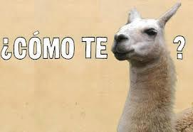

The **LLaMaPUn** library *will* consist of a wide range of processing tools for natural language and mathematics.

---
**New:** Efforts have started in adopting third-party tools (such as the [SENNA](http://ml.nec-labs.com/senna/) NLP toolkit) and adapting them to the focus of mathematical documents. As such, the current build target is refocused on the C programming language, migrating away from Perl. Given the portability of C, we expect to eventually offer high level wrappers for a variety of scripting languages.

Please remember that all third-party tools enforce their own licensing constraints.

**Disclaimer:** This Github repository is currently undergoing gradual migration from the original [subversion repository](https://svn.kwarc.info/repos/lamapun/lib/).
The migration consists of reorganizing the libraries, and preparing a CPAN-near bundle including a testbed and detailed documentation.
This process also brings a namespace change to the now properly spelled LLaMaPUn.

Several upcoming deployments of the [CorTeX framework](https://github.com/dginev/CorTeX) have motivated the move to GitHub
and provide an outlook for a number of fixes and features to be added to the library.

## High-level Overview
 * **Preprocessing**
   * Unicode normalization,
   * Stopwords - based on widely accepted lists, enhanced for STEM texts,
   * Semi-structured to plain text normalization (math, citations, tables, etc.),
   * Purification of text and math modality (e.g. move trailing dots left in math back into the sentence text),
   * Stemming - adaptation of the [Morpha](http://www.sussex.ac.uk/Users/johnca/morph.html) stemmer,
   * Tokenization - rule-based sentence segmentation, and [SENNA](http://ml.nec-labs.com/senna/) word tokenization
 
 * **Shallow Analysis**
   * Language identification (via [libTextCat](http://software.wise-guys.nl/libtextcat/)),
   * N-gram footprints,
   * Part-of-speech tagging (via [SENNA](http://ml.nec-labs.com/senna/)),
   * Named Entity recognition (via [SENNA](http://ml.nec-labs.com/senna/)),
   * Chunking and shallow parsing (via [SENNA](http://ml.nec-labs.com/senna/)),
   * [TODO] Definition Discovery -- paragraph discrimination task (training CRF models via [CRFsuite](http://www.chokkan.org/software/crfsuite/)).
 
 * **Representation Toolkit**
   * Document Narrative Model (DNM) addition to the XML DOM
   * XPointer and string offset annotation support
   * Integration with the [CorTeX](https://github.com/dginev/CorTeX) processing framework
   * [TOPORT] Shared Packed parse forests for mathematical formulas (aka "disjunctive logical forms")

## See also
 * The official [project page](https://trac.kwarc.info/lamapun/) at Jacobs University 
 * The kick-off [LaMaPUn paper](http://www.kwarc.info/projects/lamapun/pubs/AST09_LaMaPUn+appendix.pdf) from 2009.
 
## Contact
Feel free to send any feedback to the project maintainer at d.ginev@jacobs-university.de

---

